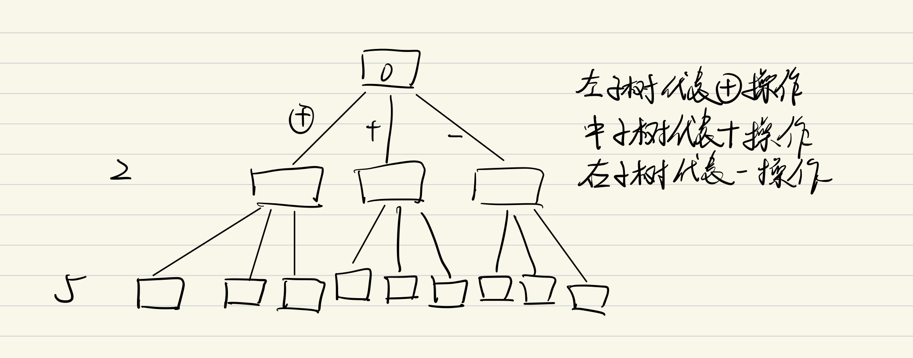
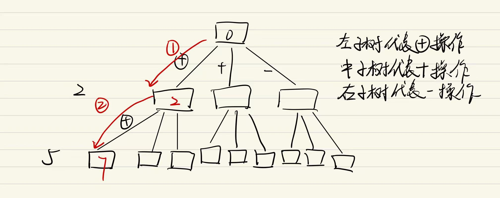
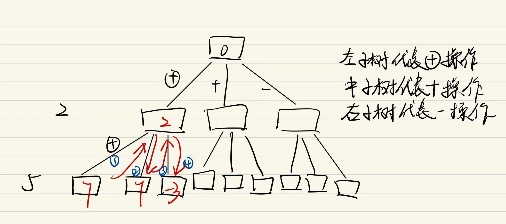

> [!TIP]
>
> 某人因为B组的最后一题花了点时间写递归发现被leetcode宠太深了不会写。谨以此文记录一下
> 
> 然后写完发现提交MLE了，事实证明我在考场是写不出来的。

# P12137 [蓝桥杯 2025 省 B] 装修报价

## 题目描述

老王计划装修房子，于是联系了一家装修公司。该公司有一套自动报价系统，只需用户提供 $N$ 项装修相关费用 $A_1, A_2, \dots , A_N$，系统便会根据这些费用生成最终的报价。

然而，当老王提交数据后，他发现这套系统的运作方式并不透明：系统只会给出一个最终报价，而不会公开任何运算过程或中间步骤。

公司对此解释称，这套系统会依据某种内部算法，在每对相邻数字之间插入 $+$（加法）、$-$（减法）或 $\oplus$（异或）运算符，并按照特定优先级规则计算结果：异或运算优先级最高，其次是加减。但由于保密性，具体的运算符组合以及中间过程都不会对外公开。

为了验证系统报价是否合理，老王决定模拟其运作方式，尝试每种可能的运算符组合，计算出所有可能出现的结果的总和。如果最终报价明显超出这个范围，他就有理由怀疑系统存在异常或误差。只是老王年事已高，手动计算颇为吃力，便向你求助。

现在，请你帮老王算出所有可能的结果的总和。由于该总和可能很大，你只需提供其对 $10^9+7$ 取余后的结果即可。

## 输入格式

第一行输入一个整数 $N$，表示装修相关费用的项数。

第二行输入 $N$ 个非负整数 $A_1, A_2, \dots , A_N$，表示各项费用。

## 输出格式

输出一个整数，表示所有可能的总和对 $10^9 + 7$ 取余后的结果。

## 输入输出样例 #1

### 输入 #1

```
3
0 2 5
```

### 输出 #1

```
11
```

## 说明/提示

对于输入样例中的三个数 $A = [0, 2, 5]$，所有可能的运算符组合共有 $9$ 种。计算结果如下：

$$0 \oplus 2 \oplus 5 = 7$$


$$0 \oplus 2 + 5 = 7$$

$$0 \oplus 2 - 5 = -3$$

$$0 + 2 \oplus 5 = 7$$

$$0 + 2 + 5 = 7$$

$$0 + 2 - 5 = -3$$

$$0 - 2 \oplus 5 = -7$$

$$0 - 2 + 5 = 3$$

$$0 - 2 - 5 = -7$$

所有结果的总和为：

$$7 + 7 + (-3) + 7 + 7 + (-3) + (-7) + 3 + (-7) = 11$$

$11$ 对 $10^9 + 7$ 取余后的值依然为 $11$，因此，输出结果为 $11$。

### 评测用例规模与约定

- 对于 $30\%$ 的评测用例，$1 \leq N \leq 13$，$0 \leq A_i \leq 10^3$。
- 对于 $60\%$ 的评测用例，$1 \leq N \leq 10^3$，$0 \leq A_i \leq 10^5$。
- 对于 $100\%$ 的评测用例，$1 \leq N \leq 10^5$，$0 \leq A_i \leq 10^9$。

---

# 分析
观察计算结果，我们可以发现主要有三个操作，异或，加法，减法。

我们将每个数作为一个节点，每个操作作为一个边，这样就可以将问题转化为一个三叉树问题。

我们可以将这三个操作分别用三个状态来表示，即：

- 左子树：异或
- 中子数：加法
- 右子树：减法
```cpp
int dp[100005];//定义在全局变量，为0
int ans;//因为定义在全局变量，为0
class Tree{
public:
    long long val;
    Tree* left;
    Tree* mid;
    Tree* right;
    long long depth;
    Tree(long long val) {
        this->val = val;
        this->left = nullptr;
        this->mid = nullptr;
        this->right=nullptr; 
    }
    void visit(Tree* root,long long num,long long depth);
}
```

也就是我们可以有如下的三叉树画图：


当然，我们可以把这种操作任意放到位子上，但是我们需要保证每个节点都有三个子树，只是这样子更方便我们观察样例。




我们可以发现，在每一层上都有一个固定的数，这个数参与了运算，这个数存储在全局变量中，**这样做的原因可以减少传入参数，我们直接把这个数作为参数传入递归函数中**。

我们可以用递归的方式来解决这个问题。

```cpp
void Tree::visit(Tree* root, long long num,long long depth) {
    if (root == nullptr) {
        ans+=num;
        return;
    }
    visit(root->left, num ^ dp[depth],depth+1);
    visit(root->mid, num + dp[depth],depth+1);
    visit(root->right, num - dp[depth],depth+1);
}
```

显然我们这样子已经把核心代码做完了，但是我们还需要考虑一些细节问题。

我们可以发现，我们的递归函数中，有三个参数，分别是：

- `Tree* root`：当前节点
- `long long num`：当前节点的值
- `long long depth`：当前节点的深度

但是，我们会发现我们并没有完成树的构建，我们需要在主函数中完成树的构建。

我们可以用递归的方式来构建树，我们可以用如下的代码来构建树：
```cpp
Tree* createTree(int depth) {
    if (depth == 0) {
        return nullptr; // 当深度为0时，返回空指针
    }

    tree* node = new tree(); // 创建一个新节点

    // 递归创建子节点
    node->left = createTree(depth - 1);
    node->mid = createTree(depth - 1);
    node->right = createTree(depth - 1);

    return node; // 返回创建的节点
}
```

然后我们有如下的主函数:
```cpp
int main() {
    int n;
    cin >> n;
    for (int i = 1; i <= n; i++) {
        cin >> dp[i];
    }
    Tree* root = createTree(n);
    root->visit(root, dp[1], 1);
    cout << ans << endl;
    return 0;
}
```

也就是有：
```cpp
#include<bits/stdc++.h>
using namespace std;
int dp[100005];//定义在全局变量，为0
int ans;//因为定义在全局变量，为0
class Tree{
public:
    long long val;
    Tree* left;
    Tree* mid;
    Tree* right;
    long long depth;
    Tree(long long val) {
        this->val = val;
        this->left = nullptr;
        this->mid = nullptr;
        this->right=nullptr;
    }
    void visit(Tree* root,long long num,long long depth);
}
Tree* createTree(long long depth,long long val) {
    if (depth == 0) {
        return nullptr; // 当深度为0时，返回空指针
    }

    Tree* node = new Tree(val); // 创建一个新节点

    // 递归创建子节点
    node->left = createTree(depth - 1,val);
    node->mid = createTree(depth - 1,val);
    node->right = createTree(depth - 1,val);

    return node; // 返回创建的节点
}

void Tree::visit(Tree* root, long long num,long long depth) {
    if (root == nullptr) {
        ans+=num;
        return;
    }
    visit(root->left, num ^ dp[depth],depth+1);
    visit(root->mid, num + dp[depth],depth+1);
    visit(root->right, num - dp[depth],depth+1);
}

int main() {
    int n;
    cin >> n;
    for (int i = 1; i <= n; i++) {
        cin >> dp[i];
    }
    Tree* root = createTree(n);
    root->visit(root, dp[1], 1);
    cout << ans << endl;
    return 0; 
}
```
~~MLE~~
为什么会MLE？
我们可以发现，假设我们有一个深度为$n$的树，那么我们的空间复杂度为$O(3^n)$，这是一个指数级别的空间复杂度，我们需要考虑如何优化这个问题。

**这一道题可以说是很明显的错误思考方向，审题不清晰，没有考虑到异或运算符的优先级，又乱用数据结构，事实证明只能是我自己的问题。**

>[!TIP]
>
>而且，这一个思考方式本身就是错的。
>为什么？因为这里我只考虑了从左到右运算，并没有考虑到异或运算符优先级最高，所以错上加错。

谨以此文，记录一下我的错误。