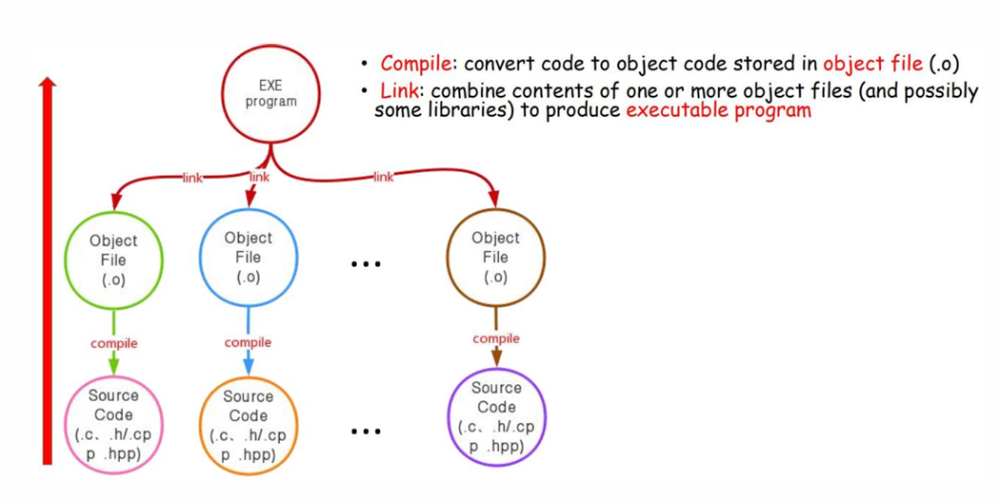
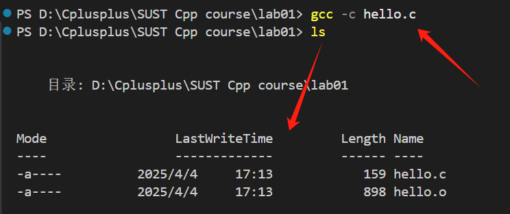
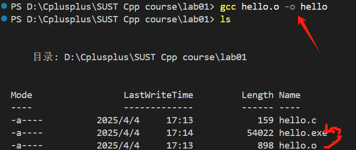
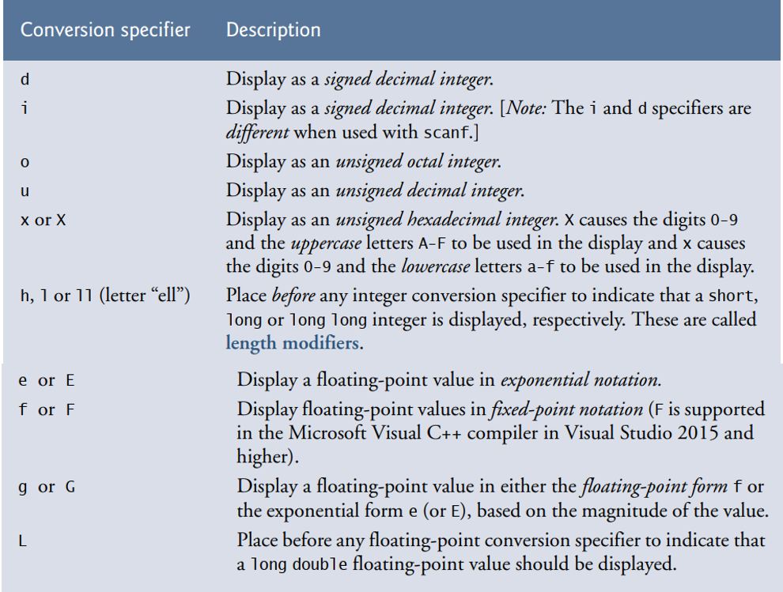
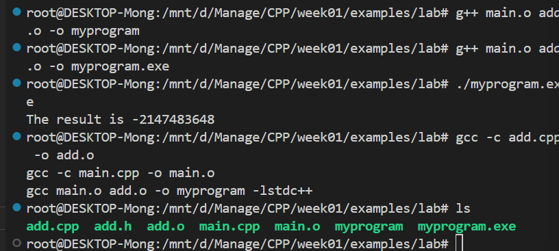

> [!TIP]
>
> Welcome to my CS205 lecture notes! Because the lecture is not in English, I will try my best to translate it.
>And at the same time, the `PPT`,`lab-file` also use the English,I will write **the English notes but not all.**

>[!NOTE]
>If you have a passion to konw more about the course, you can click the link below to learn more about the course.
>Read the repo.
>
>::github{repo="MongxinChan/CPP"}
# Lab 1


## Task 1 Install WSL

install wsl

```bash
wsl --install
```

In this task,I fail to install wsl.
So I do this :

```bash
wsl -l -o
wsl --install -d Ubuntu-20.04
```


That's my successful examples.

```bash
DISM.exe /Online /Enable-Feature /FeatureName:VirtualMachinePlatform /All /NoRestart
```


use the `bash` to start the system:

```bash
wsl -l -v
wsl -d Ubuntu-24.04
```


the username and password is

```bash
I donnot update in the markdown = =
```


we see that the `Ubuntu-24.04` has been installed.


```bash
sudo apt update
sudo apt install g++ -y
```

we use the commond to check their version up

```bash
gcc --version
```


## Task 2 Use the WSL in visual studio code

Open the `vscode`(Downloaded)


We use the `Ctrl`+`Alt`+`O` to command the system, and wait for a while to install the server of WSL

If the connection is successful you will see:


`/mnt/d/Code/Cplusplus/SUST Cpp course/` is a file path, typically used in a `Linux` system to indicate a directory within a mounted Windows file system. Here’s a breakdown of its components:

- **`/mnt/d`**: In Linux, `/mnt` is a mount point directory commonly used for mounting external storage devices or partitions. `/mnt/d` indicates that the D drive from a Windows system is mounted here.


## Task 3 Compile,Link and Run C/C++ Programs






The step called `Compile`



We create  the `.exe` post-name-file. The step called `Linking`


The default output executable file is called “a.exe”(Windows) or “a.out”(Unix  and Mac OS) if you don’t specify the name in compiling and linking step.


**You need to use `g++` to compile C++ program. The `-o` option is used to `specify the output file name`.**


## Task 4 Terminal Output

**printf**(format-control-string, other-arguments) f**ormat-control-string** describes the output format, which consists of conversion specifiers, field  widths, precisions and literal characters with percent sign(%).




## Task 5 Execrise

We couldnot directly compile the `main.cpp` if we only compile the `main.cpp` advoke `g++ -o main main.cpp && ./main`


1. 方法

    - **编译 `add.cpp` 文件生成对象文件**：

        ```bash
        g++ -c add.cpp -o add.o
        ```

    - **编译 `main.cpp` 文件生成对象文件**：

        ~~~bash
        g++ -c main.cpp -o main.o
        ~~~


    - 链接两个对象文件生成可执行文件：
    
        ~~~bash
        g++ main.o add.o -o myprogram.exe
        ~~~
    
        ```bash
        gcc -c add.cpp -o add.o
        gcc -c main.cpp -o main.o
        gcc main.o add.o -o myprogram -lstdc++
        ```

2. Cmake

- 步骤 1: 创建 CMakeLists.txt 文件

    在你的项目根目录下创建一个名为 `CMakeLists.txt` 的文件。这个文件将包含构建项目的指令。

    ```cmake
    cmake_minimum_required(VERSION 3.10)
    
    # 项目名称
    project(MyProject)
    
    # 设置 C++ 标准
    set(CMAKE_CXX_STANDARD 11)
    set(CMAKE_CXX_STANDARD_REQUIRED True)
    
    # 添加源文件
    add_executable(myprogram main.cpp add.cpp)
    ```

- 步骤 2: 创建构建目录

    在项目根目录下创建一个名为 `build` 的目录，用于存放构建文件。

    ```bash
    mkdir build
    cd build
    ```

- 步骤 3: 运行 CMake

    在 `build` 目录中运行 `cmake` 命令，指定源代码目录。

    ```bash
    cmake
    ```


    这个命令会读取 `CMakeLists.txt` 文件，并生成适合你的系统的构建文件（如 Makefile 或 Visual Studio 解决方案文件）。

- 步骤 4: 编译项目

    使用生成的构建文件编译项目。

- 如果你使用的是 Makefile（通常是在 Unix-like 系统上）：

    ```bash
    make
    ```

- 如果你使用的是 Visual Studio（在 Windows 上）：

    打开生成的解决方案文件，并在 Visual Studio 中构建项目。

