> [!TIP]
>
> Welcome to my CS205 lecture notes! Because the lecture is not in English, I will try my best to translate it.
>
> And at the same time, the `PPT`,`lab-file` also use the English,I will write **the English notes but not all.**

>[!NOTE]
>
>If you have a passion to konw more about the course, you can click the link below to learn more about the course.
>Read the repo.
>
>::github{repo="MongxinChan/CPP"}

> [!IMPORTANT]
>
> 由于本文篇幅过长，个人会添加适当的中文注解在里面。

**Introduction:**

In this note, you will learn about that:

1. CMake

2. Inputs

    - Command-Line Arguments

    - Standard Input

3. Data storage 
    - array, string, struct, union

4. Exercises 

# **CMake**

## 1.1 What's the CMake?

**CMake** is an open-source, cross-platform family of tools designed to build, test and package software. **CMake** is used to control the software compilation process using simple platform and compiler independent configuration files, and generate native makefiles and workspaces that can be used in the compiler environment of your choice.


**CMake** needs **CMakeLists.txt** to run properly.

A CMakeLists.txt consists of **commands** , **comments** and **spaces**.

- The **commands** include command name, brackets and parameters , the parameters are separated by spaces. Commands are not case sensitive.
- **Comments** begins with `#`.


Steps for generating a makefile and compiling on Linux using CMake: 

**Step1**: Writes the CMake configuration file **CMakeLists.txt**.

**Step2**: Executes the command **cmake** **PATH** to generate the **Makefile**.(PATH is the directory where the CMakeLists.txt resides.)

**Step3**: Compiles using the **make** command.

## 1.2 A single source file in a project

The most basic project is an executable built from source code files. For simple projects, a three-line **CMakeLists.txt** file is all that is required.

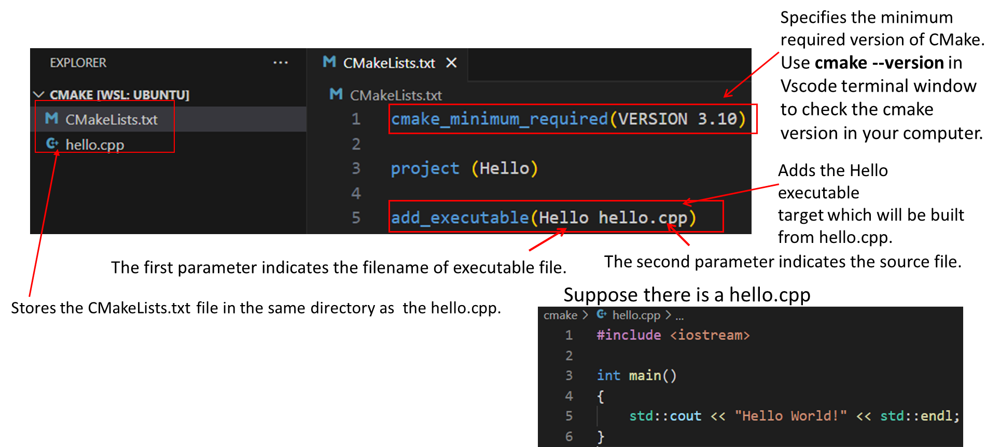

```cmake
cmake_minimum_required(VERSION 3.10)
#usa cmake --version in Vscode terminal window to check the cmake version in your computer.

add_executable(Hello hello.cpp)
#Adds the Hello executable target which will be built from hello.cpp
```


In current directory, type **cmake** **.** to generate makefile. If cmake does not be installed, follow the instruction to install cmake.

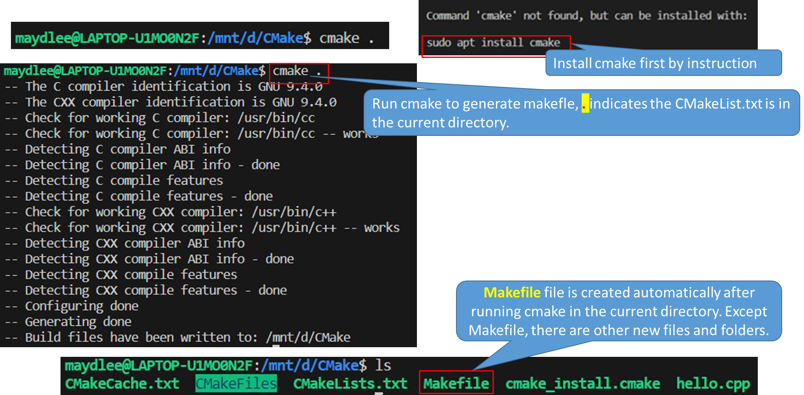


## **1.3 Multi-source files in a project**


**Yep, you just need to appendix to the rear the files' name.**

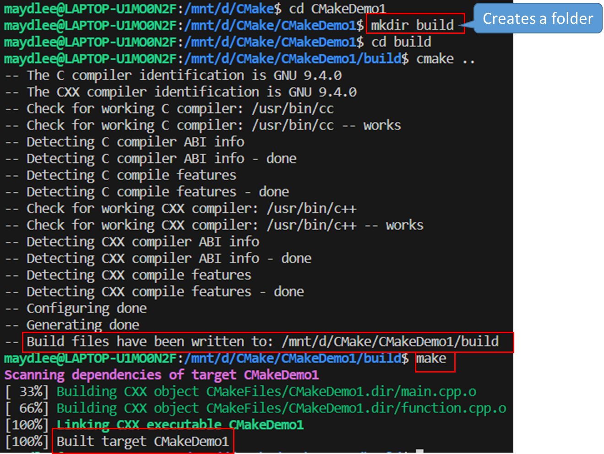


### **1.3.1 Multi-source files in a project-1**

If there are several files in directory, put each file into the **add_executable** command is not recommended. The better way is using**aux_source_directory** command.


### **1.3.2 Multi-source files in a project-2**


```cmake
aux_source_directory(. DIR_SRCS)
#stores all files in the current directory into the variable DIR_SRCS.

add_executable(hello ${DIR_SRCS})
# add_executable(hello main.cpp factorial.cpp printhello.cpp)  ERROR
# add_executable(hello src/main.cpp src/factorial.cpp src/printhello.cpp)  right relative path~

```


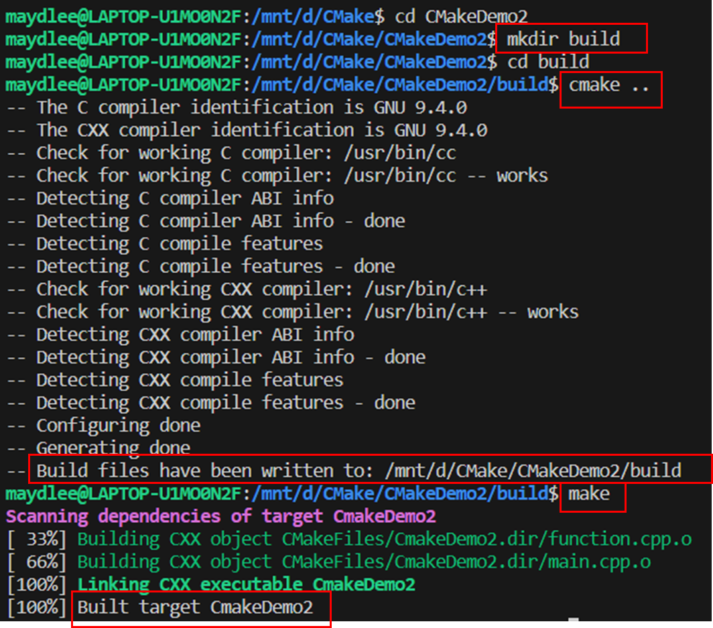

### **1.3.3 Multi-source files in a project in different directories**

**We write CMakeLists.txt in <u>CmakeDemo3 folder.</u>**

```plaintext
./CmakeDemo3
│
├── src/
│   ├── main.cpp
│   └── function.cpp
│
└── include/
    └── function.h
```

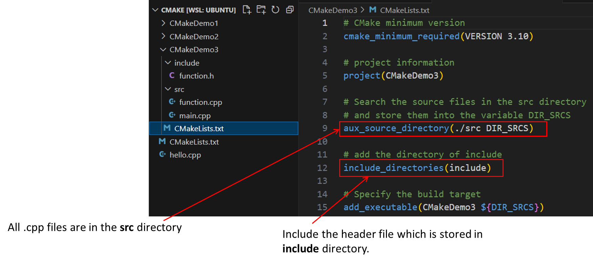

```cmake
aux_source_directory(./src DIR_SRCS)
# aux_source_directory(<dir> <variable>)
```


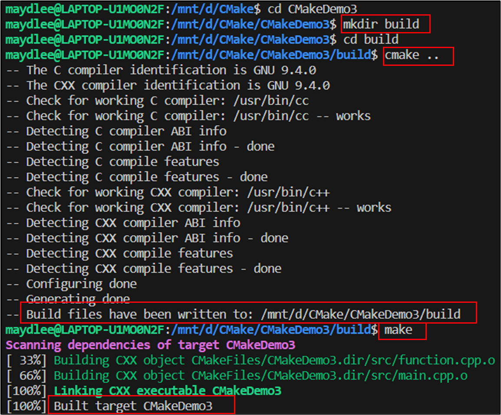

# Inputs

## 2.1 Command-Line Arguments

- At the beginning of program execution, arguments are read.
- All the arguments here are treated as string.
- Suitable for scenarios involving scripts and tools, but lacks interactivity.

```cpp
#include <stdio.h>   // c_a_demo.c

int main(int argc, char*argv[]){
    if(argc ==1)
        printf("ONLY argv[0]:%s\n",argv[0]);
    else
        for(int i=0;i<argc;i++)
            printf("argv[%d]: %s\n",i, argv[i]);

    return 0;
}

```


## 2.2 Standard Input

- During program execution, read input data from standard input devices.
- Support different types of input data.
- Suitable for interacting with users.

```cpp
#include <stdio.h>

int main(int argc, char*argv[]){
    char uname[10]={""};
    char dname[10]={""};
    char cname[10]={""};
    printf("please input the name of University: ");
    scanf("%s", uname); 
    printf("please input the name of department: ");
    scanf("%s", dname);
    printf("please input the name of course: ");
    scanf("%s", cname);     
    printf("uname: %s, dname: %s, cname:%s\n",uname,dname,cname);  
    return 0;
}

```


### 2.2.1 C style：scanf, gets vs fgets

**scanf**

1.  **%d** **----int**
2.  **%f** **----float**
3. **%c** **-----char**
4.  <u>**%s** **-----string**</u>(There's no &)

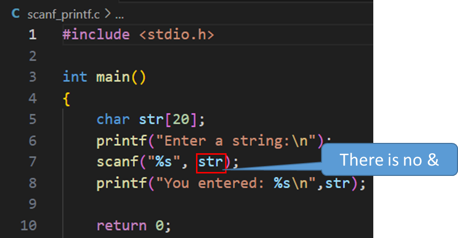


```cpp
#include <stdio.h>

int main(){
    int prj_id=0;
    float prj_sc=0.0f;
    char valid=0;
    printf("please input 'project id' in decimal int: ");
    scanf("%d", &prj_id); 
    printf("please input the score : ");
    scanf("%f", &prj_sc);
    printf("please input the score is valid or not(Y/N): ");
    while (getchar() != '\n');
    scanf("%c", &valid);     
    printf("project id: %d, score: %.1f, %s\n",
               prj_id, prj_sc, (valid=='y'||valid=='Y')?"VALID":"NOT VALIDE" );  
    return 0;
}

```


> [!TIP]
>
> When using scanf ("% d") or scanf ("% f") to read values, scanf skips leading whitespace characters (spaces, line breaks, etc.), but does not consume line breaks in the input stream (i.e., those generated by pressing enter).

---

**gets**

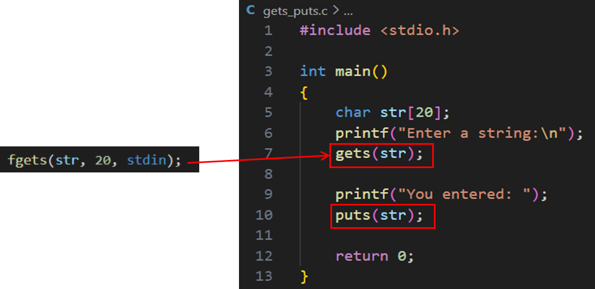


### 2.2.2 C++ style: cin, cin.gets vs cin.getline, getline()

**cin**

- The **cin** is to use `whitespace--spaces`,`tabs`, and `newlines` to **separate** a string.

>[!CAUTION]
>
>注意此时要使用g++编译，否则会出现如下的报错
>
>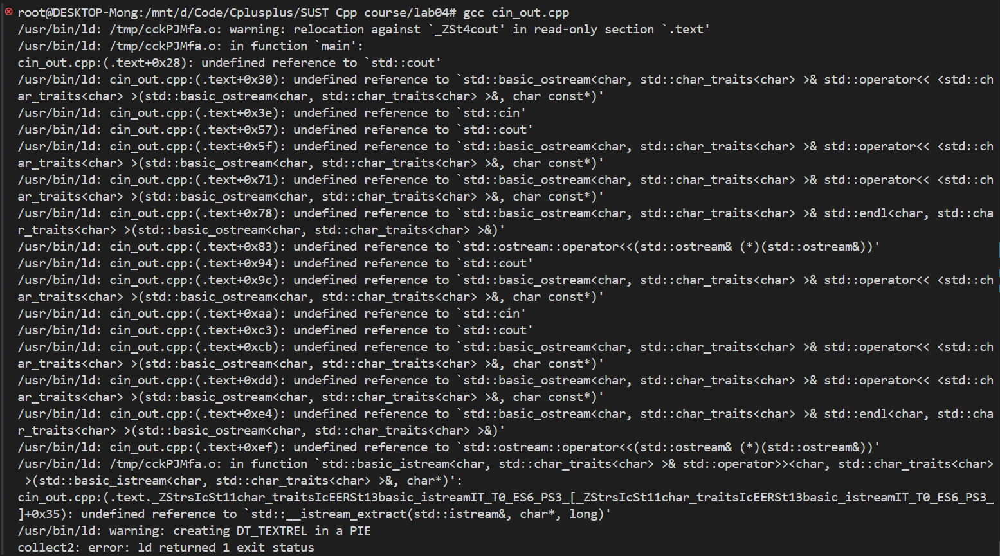
>
>这是由于gcc编译器中并未引入**namespace**导致的。


Result:


**cin.get( )**

- Input a single character:

    - **istream& get(char&);**

    - **int get(void);**

- Input a string:
    - **istream& get(char\*,int);**


**cin.getline( )** 

- Input a string:
    - **istream& getline(char\*,int);**

.png)

**cin.get( ) vs cin.getline( )**

**getline()** and **get()** both read an entire input line—that is, up until a newline character. 

However, **getline()** **<u>discard</u>** the newline character, whereas get() leave it in the input queue.


**getline()** function takes the input 

stream as the first parameter which is `cin` and `str` as the location of the  line to be stored.

.png)

Features.png)

## 2.3 others inputs source

Besides reading data from standard input (typically the keyboard), C++ programs can also obtain input from the following sources:

- **Files:** Data can be read from files using file stream classes such as `ifstream`. This allows programs to process data stored in various file formats.

- **Network:** Input can be received from remote servers or clients through network sockets. This involves network programming, which can use libraries like `Boost.Asio` or other networking libraries to handle TCP/IP communication.

- **GUI (Graphical User Interface):** User input can be gathered through GUI elements such as text boxes, buttons, and sliders. This typically involves using GUI frameworks like `Qt`, `GTK`, or `WxWidgets` to create and manage the graphical interface.

- **Database:** Data can be retrieved from databases using database connections and queries. This often requires database-specific libraries or connectors, such as `ODBC`, `MySQL Connector`, or `SQLite`, to interact with the database server.

- **Sensors:** Input can be acquired from physical sensors through hardware interfaces. This may involve using specific hardware drivers or APIs provided by the sensor manufacturer to communicate with and retrieve data from the sensors.

Each of these input methods may require additional setup and configuration, as well as the inclusion of appropriate libraries or frameworks in your C++ project to handle the input operations effectively.

# Storage

## 3.1.Data storage on construction type

### 3.1.1 array:

- One dimensional array and two-dimensional array

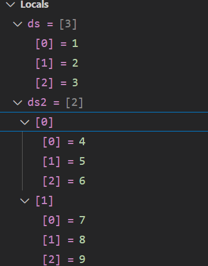


- using `x` command in `gdb` to examine the data storage details
    - address: starting from the position specified by the subsequent parameters
    - datas: for example, option **`/3dw`** here means show the data stored in the space of **3** consecutive **w**ords starting from the address in **d**ecimal.


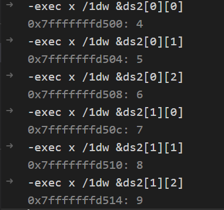

### 3.1.2 string:

- char array vs string

```cpp
#include<iostream>
#include<cstring>
using namespace std;

int main(){
    char SC[ ]="SUSTECH";
    char sc[ ]= {'s','u','s','t','e','c','h'};

    printf("size of SC: %ld bytes, sc: %ld\n",sizeof(SC), sizeof(sc));

    return 0;
}

```


**The string terminator character(\000, value 0) is automatically included at the end of the string, but there is no such automatic operation in character arrays** 

### 3.1.3 struct:

- align

```cpp
#include<stdio.h>
struct data{
    int a;
    char c;
};

int main(){
    struct data icx;
    icx.a = 0x11223344;
    icx.c = 0x56;

    printf("size of icx: %ld\n",sizeof(icx));
    printf("size of icx.a: %ld, icx.a=0x%x\n",sizeof(icx.a),icx.a);
    printf("size of icx.c: %ld, icx.c=0x%x\n",sizeof(icx.c),icx.c);
    return 0;
}

```


**Each member in the struct occupies exclusive space and is filled with necessary padding to achieve alignment.**

### 3.1.4 union:

- share

```cpp
#include<stdio.h>
union data
{
    int a;
    char c;
};

int main()
{
    union data endian;
    endian.a = 0x11223344;
    endian.c = 0x56;

    printf("size of endian: %ld\n",sizeof(endian));
    printf("size of endian.a: %ld,endian.a=0x%x\n",sizeof(endian.a),endian.a);
    printf("size of endian.c: %ld,endian.c=0x%x\n",sizeof(endian.c),endian.c);

     return 0;
}

```


**All members in the union share the same space.**

# Exercise

## 4.1 Exercise

Please refer to the content of courseware to generate a makefile using cmake tool and CMakeLists.txt, run the makefile to generate an executable file, and then run the executable file.

> [!NOTE]
>
> All the source files are in `./src` , all the head files are in ./inc, all the build files are in `./build`.

```cmake
# CMake minimum required version
cmake_minimum_required(VERSION 3.10)

# project information,也就是最后生成的可执行文件名称
project(hello)

# Search the source files in the src directory
# and store them into the variable DIR_SRCS
aux_source_directory(./src DIR_SRCS)

# aux_source_directory(<dir> <variable>)
# 将src目录下的所有源文件存储到变量DIR_SRCS中

# add the directory of include files
include_directories(./include)


# 添加可执行文件
add_executable(hello ${DIR_SRCS})
# add_executable(hello main.cpp factorial.cpp printhello.cpp)  ERROR
# add_executable(hello src/main.cpp src/factorial.cpp src/printhello.cpp)  right relative path~
```


## 4.2 Exercise

First, complete the code, then run the program, explain the result and answer the following question to SA. If it has bugs, fix them.

```cpp
#include <iostream>
#include <string.h>
using namespace std;
int main()
{
    int cards[4]{};
    int hands[4];
    int price[] = {2.8,3.7,5,9,`C`, `D`}; 
    char direction[4] {'L',82,'U',68};
    char title[] = "DeepSeek is an awesome tool.";   
    cout << "sizeof(cards) = " << sizeof(cards) << ",sizeof of cards[0] = " << sizeof(cards[0]) << endl;
    cout << "sizeof(price) = " << sizeof(price) << ",sizeof of price[0] = " << sizeof(price[0]) << endl;
    cout << "sizeof(direction) = " << sizeof(direction) << ",length of direction = " << strlen(direction) << endl;
    cout << "sizeof(title) = " << sizeof(title) << ",length of title = " << strlen(title) << endl;

    return 0;
}

```

Q. It is asked to get the the number of characters in `dirction`(which should be 4) by using strlen without changing the size of the `dirction` array, one option is to add a piece of code between the definitions on `dirction` and `title`:

Here's a different implementation of my original code, modifying some details:
I change the data-type of the `price[]` and add the '\0' in the last of `direction[]`.

```cpp
float price[] = {2.8,3.7,5,9,'C', 'D'}; 
char direction[]= {'L',82,'U',68,'\0'};
```

## 4.3 Exercise

```cpp
#include <stdio.h>  //p2.c
union data{
    int n;
    char ch;
    short m;
};
int main(){
    union data a;
    printf("%d, %d\n", sizeof(a), sizeof(union data) );
    a.n = 0x40;
    printf("%X, %c, %hX\n", a.n, a.ch, a.m);
    a.ch = '9';
    printf("%X, %c, %hX\n", a.n, a.ch, a.m);
    a.m = 0x2059;
    printf("%X, %c, %hX\n", a.n, a.ch, a.m);
    a.n = 0x3E25AD54;
    printf("%X, %c, %hX\n", a.n, a.ch, a.m);

    return 0;
}

```

Run the program and explain the result to SA. 

Just compile the file, we see the question:


So let's change `%d` to `%zu` or `%ld`. The cause of the compilation error requires that the inputs format match the output format.

## 4.4 Exercise

```cpp
#include <iostream>
using namespace std;
enum Day{/*complete code here if needed*/};
enum Weather{/*complete code here if needed*/};

int main( /*complete code here if needed*/ ){
    int d=0;
    int w=0;
    cout<<"input the Day value:
 Monday(1), Tuesday(2), Wednesday(3), Thursday(4), 
Friday(5), Saturday(6), Sunday(7)\n";
   /*complete code here if needed*/

    cout<<"This is"<</*complete code here if needed*/<<endl;

    cout<<"input the Weather value: SUNNY(0), RAINY(1), CLOUDY(2), SNOWNY(3)\n";
     /*complete code here if needed*/

    cout<<"The weather is: "<< /*complete code here if needed*/;

   if(/*complete code here if needed*/) cout<<"can Travel\n";
    else cout<<"not suitable for travelling\n"; 
    return 0;
}

```


1. Design two enumeration types. The first is an enum **`Day`** for (Monday, Tuesday, Wednesday, Thursday, Friday, Saturday, Sunday), and the second is an enum **`Weather`** for (SUNNY, RAINY, CLOUDY, SNOWNY).

2. Complete the main function, which ask user to input the day value and the weather value accoding to the notice information, if the day is at weekend and the weather is SUNNY, pring out `can Travel`, else print out `not suitable for travelling`.


**Above the code is my Implement:**

```cpp
#include <iostream>
using namespace std;
enum Day{
    Monday = 1, Tuesday = 2, Wednesday = 3, Thursday = 4, 
    Friday = 5, Saturday = 6, Sunday = 7
};
enum Weather{    SUNNY = 0, RAINY = 1, CLOUDY = 2, SNOWY = 3};

int main() {
    int d = 0;
    int w = 0;

    // 提示用户输入星期值
    cout << "Input the Day value: Monday(1), Tuesday(2), Wednesday(3), Thursday(4), "
         << "Friday(5), Saturday(6), Sunday(7)\n";
    cin >> d;

    // 根据输入的星期值输出对应的星期名称
    cout << "This is ";
    switch (d) {
        case Monday:    cout << "Monday"; break;
        case Tuesday:   cout << "Tuesday"; break;
        case Wednesday: cout << "Wednesday"; break;
        case Thursday:  cout << "Thursday"; break;
        case Friday:    cout << "Friday"; break;
        case Saturday:  cout << "Saturday"; break;
        case Sunday:    cout << "Sunday"; break;
        default:        cout << "Invalid Day"; break;
    }
    cout << endl;

    // 提示用户输入天气值
    cout << "Input the Weather value: SUNNY(0), RAINY(1), CLOUDY(2), SNOWY(3)\n";
    cin >> w;

    // 根据输入的天气值输出对应的天气名称
    cout << "The weather is: ";
    switch (w) {
        case SUNNY:   cout << "Sunny"; break;
        case RAINY:   cout << "Rainy"; break;
        case CLOUDY:  cout << "Cloudy"; break;
        case SNOWY:   cout << "Snowy"; break;
        default:      cout << "Invalid Weather"; break;
    }
    cout << endl;

    // 判断是否适合出行
    if ((d >= Monday && d <= Friday && w == SUNNY) || (d == Saturday && w != RAINY) || (d == Sunday && w != RAINY)) {
        cout << "Can travel\n";
    } else {
        cout << "Not suitable for travelling\n";
    }

    return 0;
}

```

We could use the command to invoke the main function

```bash
echo 6 0 | ./a.out
```


